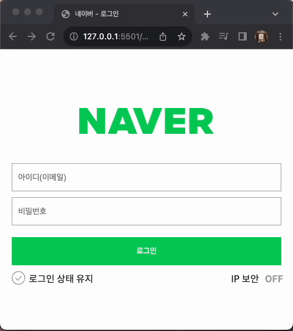
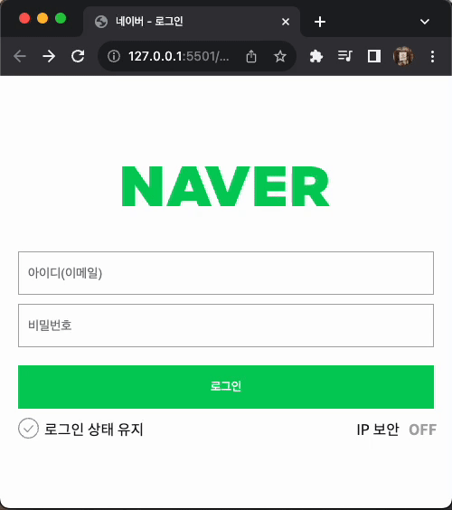

### 📌 네이버 로그인 페이지 구현

- 일치하는 아이디와 비밀번호를 입력했을 경우 welcome 페이지로 이동하는 코드 로직 작성
  <br />

### 🔍 Preview

|                유효성(X), user(X)                |                유효성(O), user(X)                |              유효성(O), user(O)               |
| :----------------------------------------------: | :----------------------------------------------: | :-------------------------------------------: |
|  |  |  |

<br />

### 📝 Description

```jsx
/**
 * 사용자 입력의 유효성 확인
 * @param {HTMLElement} inputElement - 유효성 검사할 입력 요소
 * @param {Function} validationFunction - 입력 값에 대한 유효성 확인 함수
 * @param {string} userProperty - 입력과 비교할 user 객체의 속성
 * @returns {boolean} - 입력이 유효하고 속성과 일치하면 true, 그렇지 않으면 false 반환
 */
const checkInput = (inputElement, validationFunc, userProperty) => {
  if (!validationFunc(inputElement.value)) {
    inputElement.classList.add('is--invalid');
    console.log('1', 1);
    return false;
  } else {
    if (inputElement.value !== user[userProperty]) {
      const wrong = userProperty == 'id' ? '아이디' : '비밀번호';
      alert(`${wrong}를 다시 입력해주세요.`);
      console.log('2', 2);
      return false;
    }
    inputElement.classList.remove('is--invalid');
    console.log('3', 3);
    return true;
  }
};
```

- 이메일과 비밀번호의 유효성을 확인하는 함수를 각각 만들었는데 대부분 비슷한 내용이라 `checkInput()`을 새로 만들었다.

- `checkInput()`은 `<input>`, 유효성 검사 함수, 비교할 user의 속성을 받고, 입력이 유효하고 user의 속성과 일치하면 `true`, 그렇지 않으면 `false`를 반환한다.

- 유효성 확인과 다르게 아이디와 비밀번호가 다를 경우 나타나야 하는 콘텐츠가 없기 때문에 `alert()`으로 나타냈다.<br />
  <br />

```jsx
// 이메일 입력의 유효성 확인 함수
const checkEmail = () => checkInput(userEmailInput, emailReg, 'id');

// 비밀번호 입력의 유효성 확인 함수
const checkPw = () => checkInput(userPwInput, pwReg, 'pw');
```

- `checkEmail()`, `checkPw()` 모두 `checkInput()`을 리턴한다.<br />
  <br />

```jsx
// 로그인 버튼에 대한 이벤트 리스너
document.querySelector('.btn-login').addEventListener('click', (e) => {
  e.preventDefault();
  if (checkEmail() && checkPw()) window.location.href = './welcome.html';
});
```

- 로그인 버튼 클릭 시 양식을 바로 제출한다. 이를 막기 위해 `e.preventDefault()`를 사용했다.
  <span style="color:gray;">→ `event.preventDefault()`: HTML에서 표준으로 제공하는 기본 이벤트를 막는다.</span>
- 이메일과 비밀번호가 모두 일치하다면 welcome.html로 이동한다.
