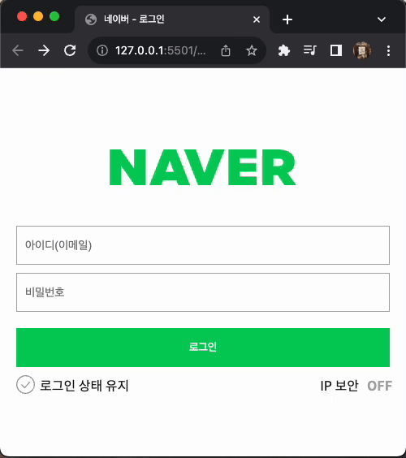

### 📌 네이버 로그인 페이지 구현

- 일치하는 아이디와 비밀번호를 입력했을 경우 welcome 페이지로 이동하는 코드 로직 작성
  <br />

### 🔍 Preview

|                유효성(X), user(X)                |                유효성(O), user(X)                |              유효성(O), user(O)               |
| :----------------------------------------------: | :----------------------------------------------: | :-------------------------------------------: |
|  |  |  |

<br />
### 📝 Description

```jsx
const emailInput = document.querySelector('.user-email-input');
const pwInput = document.querySelector('.user-password-input');
const loginButton = document.querySelector('.btn-login');

let isValid = {
  email: false,
  pw: false,
};
```

→ 수정사항: `isValid` 객체는 상태 저장을 위해 추가했다.

```jsx
/**
 * 입력 요소의 유효성 검사 함수
 * @param {function} validationFunction - 유효성 검사 함수
 * @param {HTMLInputElement} element - 유효성 검사할 입력 요소
 * @param {string} validationType - 유효성 검사 유형
 */
const inputValidate = (validationFunction, element, validationType) => {
  if (validationFunction(element.value)) {
    element.classList.remove('is--invalid');
    isValid[validationType] = true;
  } else {
    element.classList.add('is--invalid');
    isValid[validationType] = false;
  }
};
```

이메일과 비밀번호의 유효성을 확인하는 함수를 각각 만들었는데 대부분 비슷한 내용이라 `inputValidate()`을 새로 만들었다.

inputValidate()은 유효성 검사 함수, 유효성 검사할 `<input>` 요소, 유효성 검사 유형(email, pw)을 받는다.

입력이 유효하다면 `<input> 태그의 is--valid 클래스를 삭제하`고, `isValid`에 `true`를 저장한다.

반대로 유효하지 않다면 `<input>`태그에 `is—valid` 클래스를 추가하고, `isValid`에 `false`를 저장한다.

```jsx
// 이메일 입력 요소 유효성 검사
const emailValidate = () => inputValidate(emailReg, emailInput, 'email');

// 비밀번호 입력 요소 유효성 검사
const pwValidate = () => inputValidate(pwReg, pwInput, 'pw');
```

`emailValidate()`, `pwValidate()` 모두 `inputValidate()`을 리턴한다.

```jsx
// 이벤트 핸들러
emailInput.addEventListener('input', emailValidate);
pwInput.addEventListener('input', pwValidate);
loginButton.addEventListener('click', clickLoginButton);
```

이메일과 비밀번호를 입력하는 `<input>`태그에 사용자가 입력을 할 때마다 이벤트가 발생하도록 했다.
로그인 버튼 클릭 시 사용자를 확인하는 이벤트가 발생하도록 했다.

→ 수정사항: 기존에는 이메일의 유효성 검사와 유저 확인, 비밀번호의 유호성 검사와 유저 확인을 각각의 함수로 만들었지만, 상태를 저장하는 `isValid` 객체를 만들고 난 후, 유효성 검사와 유저 확인을 각각의 함수로 만들었다.

```jsx
/const clickLoginButton = (e) => {
  e.preventDefault();
  if (!(isValid.email && isValid.pw)) return;

  if (user.id === emailInput.value && user.pw === pwInput.value) {
    location.href = 'welcome.html';
  } else {
    alert('입력한 정보가 올바르지 않습니다. 다시 시도해주세요.');
  }
};

```

로그인 버튼 클릭 시 양식을 바로 제출한다. 이를 막기 위해 `e.preventDefault()`를 사용했다.

→ `event.preventDefault()`: HTML에서 표준으로 제공하는 기본 이벤트를 막는다.

이메일과 비밀번호가 유효성 검사에 통과하고, 지정한 사용자라면 welcome.html로, 아니라면 `alert()`이 보이게 했다.

### 📌 feedback

- 강사님: 유효성 검사부터 README작성까지 너무 잘해주셔서 놀랐습니다~ㅎㅎ 거기에 JSDoc까지 작성해주시고 👍 상태변수 관리만 넣어주시면 좋을 것 같아요. 이벤트들은 함수로 따로 빼주는게 유지보수 측면에서 좋을 것 같습니다
- 회고조: 해커의 공격 시도 시 사용자의 계정 노출이 더 많을 수 있기 때문에 이메일/비밀번호 등을 언급하지 않고 포괄적인 표현이 더 좋을 것 같다.
- 개인적: 회고조 사람들의 코드를 봤을 때, 코드를 작성하는데 불편하지는 않았지만 변수가 너무 적은 게 아닌가 싶었다. 가독성이 좋지 않은 코드인가? 고민을 했었고, 아직도 가독성에 좋은지는 잘 모르겠다. 그리고 변수명 지정이 힘들었던 것 같다.
